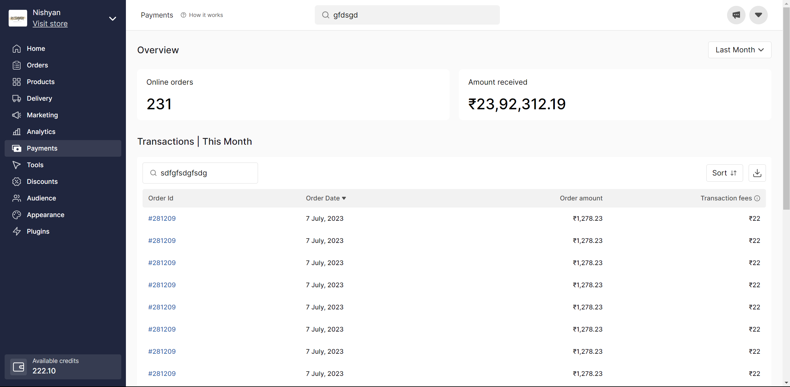

## Dukaan.io Assignment

First, add node_modules to your project

```bash
npm install
# or
yarn install
```
Then start the development server:

```bash
npm run dev
# or
yarn dev
```

Open [http://localhost:3000](http://localhost:3000) with your browser to see the result.


## Output

